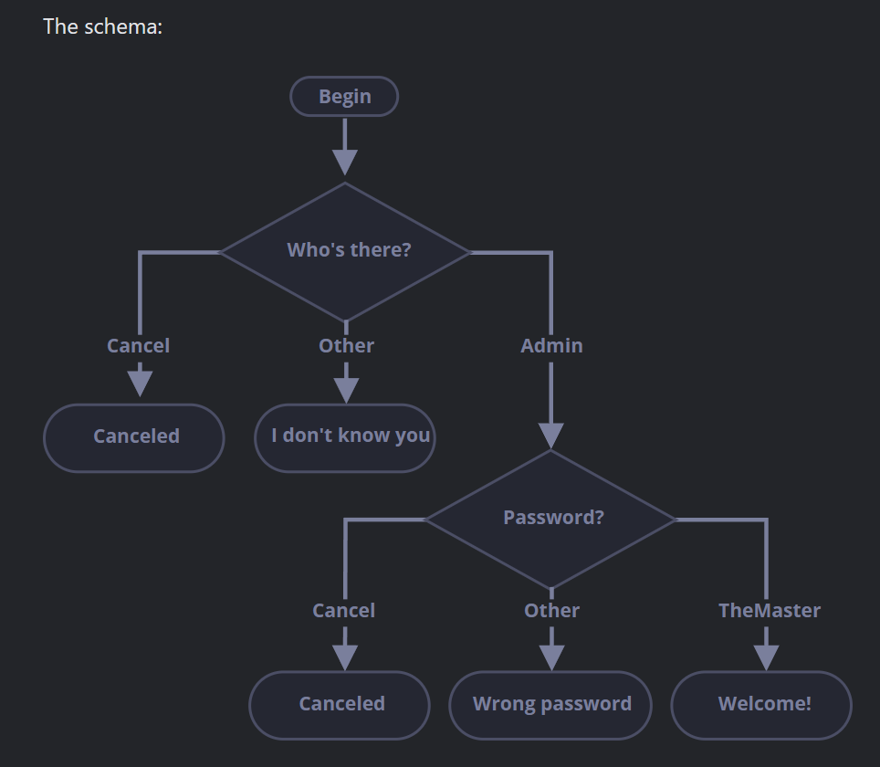

# check_login
Task for creating a basic login flow using if-else and logical operators

### Flow Chart

This is ["javacscript.info task"](https://javascript.info/task/check-login) that practices
the conditional if-else and logical operators

Write the code which asks for a login with prompt.

If the visitor enters "Admin", then prompt for a password, if the input is an empty line or Esc – show “Canceled”, if it’s another string – then show “I don’t know you”.

The password is checked as follows:

If it equals “TheMaster”, then show “Welcome!”,
Another string – show “Wrong password”,
For an empty string or cancelled input, show “Canceled”

### Pseudo Code
 
Write the code which asks for a login with prompt.

    If the visitor enters "Admin", then prompt for a password, if the input is an empty line or Esc – show “Canceled”, if it’s another string – then show “I don’t know you”.

    The password is checked as follows:

    If it equals “TheMaster”, then show “Welcome!”,
    Another string – show “Wrong password”,
    For an empty string or cancelled input, show “Canceled”

    ### Pseudo Code

    Ask user "Who's there?"
    and check for input...

    if (user press 'cancel' || 'esc' || blank )
        then print("Canceled")

    if (user input != Admin)
        then print("I don't know you")

    if (user input = Admin)
        then ask for password
            if (user 'cancel' ||'esc' || blank)
                then print("Canceled")
            
            if (user input wrong password)
                then print(Wrong password)

            if (user input = TheMaster) // Case sensitive
                then print("Welcome!")